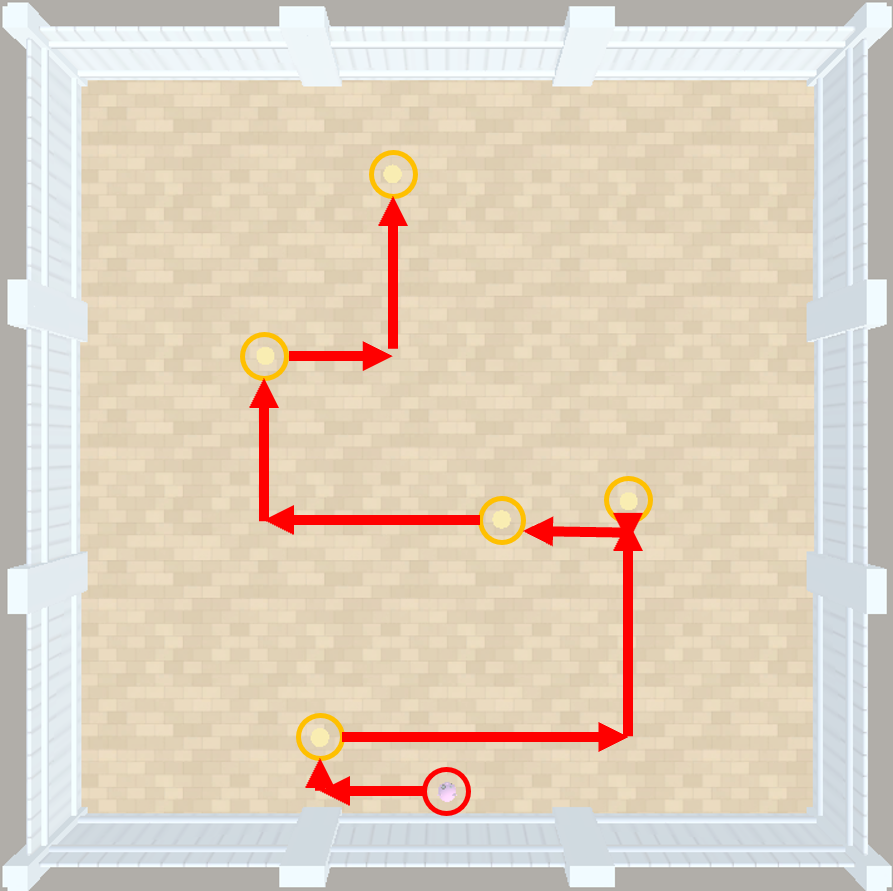
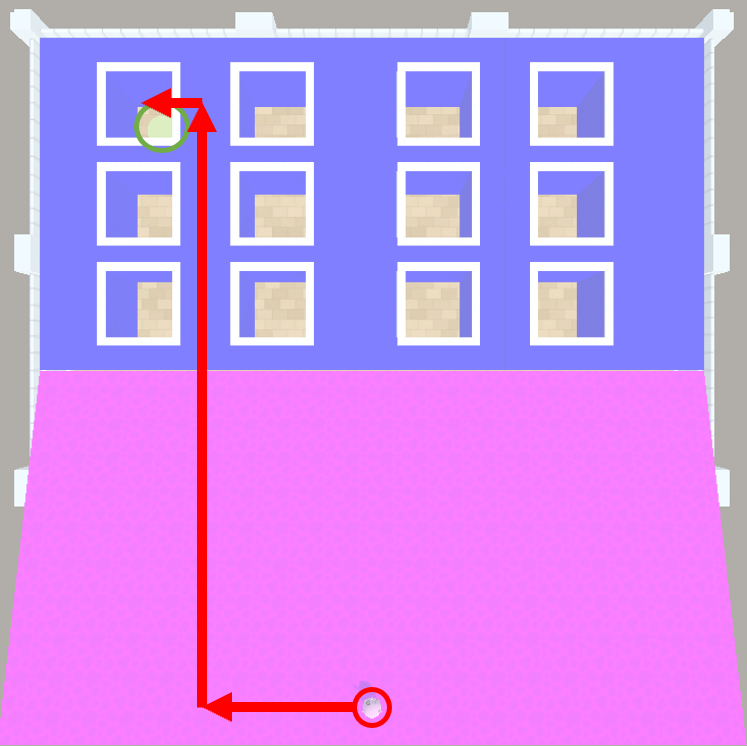

# Meta Data for Comparative Object Permanence

To conduct psychometric evaluation of agents on our [tests](../configs/test_agents/), we need to be able to characterise what the demands of each instance are. In other words, we need to know which tests are good tests of capability X, Y, or Z. To do this, we outline properties of the tests that are deemed relevant (or irrelevant) to particular capabilities. We call this *metadata*, i.e. data about the test set for which we collect performance data.

This document outlines each metadata variable that our instances vary across, found [here](../analysis/meta-data-full.csv). Some of them are intuitive, but others require more involved explanation.

## `InstanceName`

The name of the instance in O-PIAAGETS.

## `Suite`

The *suite* of tests from which the task is drawn. Here, this is either `Controls` (tasks that control for alternative explanations for why an agent might perform in a certain way); and `Spatiotemporal Continuity` (tasks where an object goes out of view but continues along the same spatiotemporal trajectory - an important heuristic in physical common-sense reasoning)

## `SubSuite`

The *sub-suite* of tests from which the task is drawn. Here, this is either `Basic` (very simple tasks testing fundamental capabilites required to interact with AAI); `OP Controls` (tasks that test whether the agent can solve tasks that *look* like the main object permanence tasks, but that do not require OP to be solved); and `Allocentric OP` (tasks where the object goes out of view independently of the actions of the agent).

## `Paradigm`

The experimental paradigm that the instance is inspired by. This really only applies cleanly to the instances in `OP Controls` and `Allocentric OP`. The two paradigms in this study are the *Primate Cognition Test Battery* (`PCTB`) and [Chiandetti and Vallortigara's (2011)](https://doi.org/10.1098/rspb.2010.2381) tests of intuitive physics in chicks (`CVChick`).

## `Task`

These are global variations of each paradigm, with objects being placed in different combinations. There tends to be a difference in difficulty between different tasks.

## `Instance`

These are local variations of each task, such as putting the goal on a different side, changing its size, or the distance it is from the agent at the start of the instance. There tends not be a difference in difficulty between different instances of a task.

## `ColorVariant`

These are the different colours of the main occluders in the test.

## `OccluderVariant`

These are the different occluder types in the test. These are ignored, and included only for legacy reasons.

## `pass_mark`

The number of points needed for performance on the test to be considered a *pass*. Varies from -0.6 to 18.9 inclusive.

## `time_limit`

The number of time steps before the episode ends automatically. This is replenished every time a `GoodGoalMulti` or `GoodGoalMultiBounce` is obtained. Only 4 values are represented here: 250, 500, 750, and *Inf* (for tests with children that did not have a time limit - so that they could take a break.)

## `lavaPresence`

A bool specifying if lava is present in the instance or not.

## `taskCriticalRampPresence`

A bool specifying if a *task critical ramp* is present in the instance or not. The term *task critical* is used because some instances contain small ramps that serve the purposes of, for example, slowing down a moving goal or creating blocks that fall over (by spawning a wall on top of a tiny ramp). These are not used by the agent to solve the task, so their presence is of less importance. This variable indicates whether there is a ramp that the agent must use to solve a problem. *Note* ramps are always pink, signifying their ramp status. They have RGB values `{r: 255, g: 0, b: 255}`

## `greenGoalPresence`

A bool specifying if a `GoodGoal` or a `GoodGoalBounce` is present in the instance.

## `yellowGoalPresence`

A bool specifying if a `GoodGoalMulti` or a `GoodGoalMultiBounce` is present in the instance.

## `stationaryGreenGoalPresence`

A bool specifying if a `GoodGoal` is present in the instance.

## `stationaryYellowGoalPresence`

A bool specifying if a `GoodGoalMulti` is present in the instance.

## `movingGreenGoalPresence`

A bool specifying if a `GoodGoalBounce` is present in the instance.

## `movingYellowGoalPresence`

A bool specifying if a `GoodGoalMultiBounce` is present in the instance.

## `numGreenGoals`

An integer specifying how many `GoodGoal` or `GoodGoalBounce` objects are in the instance. This mostly applies to those tasks that contain only `GoodGoalMulti` or `GoodGoalMultiBounce` objects, or the few tasks that contain decoy `GoodGoal` objects (e.g., *OP-STC-Allo-CVChick-1Occluder1DecoyG-Left-Beige-0-OPQ.yml*). Varies from 0 to 3 inclusive.

## `numYellowGoals`

An integer specifying how many `GoodGoalMulti` or `GoodGoalMultiBounce` objects are in the instance. Varies from 0 to 5 inclusive.

## `numGoalsAll`

The number of all objects of type `GoodGoal*`. Varies from 1 to 5 inclusive.

## `mainGoalSize`

A float specifying the size of the target goal(s) (excluding decoys) in the instance. Varies from 0.5 to 5 inclusive.

## `multipleGoalSameSize`

A bool specifying if, when there are multiple goals, they are the same size. It is also false if there is only one goal.

## `frozenAgentPresence`

A bool specifying if the instance freezes the agent's position for a specified amount of time at the start of the episode.

## `frozenAgentDelayLength`

An integer specifying how many timesteps the agent is frozen for at the start of the episode. This value is 0 if `frozenAgentPresence` is false, by default. Only two values are present here: 0 and 10.

## `lightsOutPresence`

A bool specifying if the instance has a *lights-out* schedule, in which visual input is stopped for a specified time.

## `lightsOutAlternatingPresence`

*Lights out* in the Animal-AI Environment can be set to a periodical schedule of on/off/on/off/... every *n* frames (*alternating*), or it can be specified to occur between two frame indices, counting from the start of the episode (*fixed*). This variable is a bool specifying if is the latter (false) or the former (true).

## `lightsOutPeriod`

An integer specifying how long the lights go out for. For instances without a *lights-out* schedule, this is 0 by default. For instances on a *fixed* schedule, this is a positive number. For instances on an *alternating* schedule, this is a negative number where the absolute value specifies the number of frames between switches from on to off or on to off. Only three values are represented here: -15, 0, and 61.

## `goalBecomesAllocentricallyOccluded`

A bool specifying if the goal(s) in the instance becomes occluded independently of the action of the agent. This delineates the object permanence tests from the controls. *Note*: it does not take into the account the possibility that the goal can be *egocentrically* occluded at certain points during gameplay. This is too hard to predict as it is contingent on action sequences.

## `opaqueWallNotPlatformPresence`

A bool specifying if there is an object of type `Wall` in the instance. This does not include if there is an object of type `Wall` that has RGB values of `{r: 0, g: 0, b: 255}`. These have a special status as platforms that crisply separate two or more zones of an arena. The agent spawns on top of these platforms and has to make a choice about which zone to enter, creating forced choice tests.

## `transparentWallPresence`

A bool specifying if there is an object of type `WallTransparent` in the instance.

## `bluePlatformPresence`

A bool specifying if there is a an object of type `Wall` that has RGB values of `{r: 0, g: 0, b: 255}`, the platform with special status (see earlier).

## `decoyPresence`

A bool specifying if there is a decoy reward in the arena.

## `decoySize`

A float specifying the size of the decoy reward. Defaults to 0 if there is no decoy. Only two values are represented here, 0 and 0.5.

## `goalLeftRelToStart`

A bool specifying whether there is a goal to the left of the agent at the start of the episode.

## `goalCentreelToStart`

A bool specifying whether there is a goal directly in front of the agent at the start of the episode.

## `goalRightRelToStart`

A bool specifying whether there is a goal to the right of the agent at the start of the episode.

## `forcedChoice`

A bool specifying if the instance is a forced-choice task.

## `opaqueWallRedValue`

An integer specifyig the redness of the colour of the `Wall` objects in the instance. Varies from 0 to 255 inclusive. This variable is *NA* when there are no `Wall` objects *and* when the colour of the wall object is randomised (any instances with `-RND-` in the `InstanceName`); this is because we can't know what the values are for these tasks.

## `opaqueWallGreenValue`

An integer specifyig the greenness of the colour of the `Wall` objects in the instance. Varies from 0 to 255 inclusive. This variable is *NA* when there are no `Wall` objects *and* when the colour of the wall object is randomised (any instances with `-RND-` in the `InstanceName`); this is because we can't know what the values are for these tasks.

## `opaqueWallBlueValue`

An integer specifyig the blueness of the colour of the `Wall` objects in the instance. Varies from 0 to 255 inclusive. This variable is *NA* when there are no `Wall` objects *and* when the colour of the wall object is randomised (any instances with `-RND-` in the `InstanceName`); this is because we can't know what the values are for these tasks.

## `opaqueWallColourRandomisationPresence`

A bool specifying if the colours of the `Wall` objects in the instance are randomised.

## `cityBlockDistanceToGoal`

A float specifying the shortest path to the goal(s) in the instance. This is calculated as though the agent takes steps in the 4 cardinal directions, and makes turns of 90 degrees. It takes into account any obstacles or holes in the floor that might be in the way. It serves as a proxy for the complexity of the navigation task, as well as for the amount of time we can expect an object to be occluded if this is an object permanence task, as the agent will likely take longer to get there. Most of the tasks are fairly intuitive to calculate distance in this way, but some are more involved. We provide schematics of the trickiest tasks to explain how certain values were arrived at. Varies from 9 to 118 inclusive. Units are in units of agent size, where the arena is of size 40x40x40.

All of these count as travelling salesman problems. There are likely alternative paths that might be more optimal. However, these are the basis of the calculations for the metadata.

### `OP-Controls-Basic-MultiStationary-5Y-*.yml`

In this task, the agent has to obtain 5 `GoodGoalMulti` objects. This is one of the paths it could take. It would follow the following route:

1. `Turn 90 degrees left.`
2. `Walk 7 units.`
3. `Turn 90 degrees right.`
4. `Walk 3 units (obtain reward).`
5. `Turn 90 degrees right.`
6. `Walk 17 units.`
7. `Turn 90 degrees left.`
8. `Walk 13 units (obtain reward).`
9. `Turn 180 degrees`
10. `Walk 1 unit.`
11. `Turn 90 degrees right.`
12. `Walk 7 units (obtain reward).`
13. `Walk 13 units.`
14. `Turn 90 degrees right.`
15. `Walk 9 units (obtain reward).`
16. `Turn 90 degrees right.`
17. `Walk 7 units.`
18. `Turn 90 degrees left.`
19. `Walk 10 units (obtain reward).`

`Total steps: 87. Total turns: 9`

### `OP-STC-Allo-CVChick-1Occluder2DecoyG-Left-Grey-0-OPQ`

In this task, the agent has to obtain 1 `GoodGoal` while avoiding a small `GoodGoal` decoy. This is one of the paths it could take. It would follow the following route:

1. `Walk 18 units.`
2. `Turn 90 degrees left.`
3. `Walk 12 units.`
4. `Turn 90 degrees right.`
5. `Walk 9 units.`
6. `Turn 90 degrees left.`
7. `Walk 3 units.`
8. `Turn 90 degrees right.`
9. `Walk 1 unit.`
10. `Turn 90 degrees right.`
11. `Walk 5 units.`
12. `Turn 90 degrees left.`
13. `Walk 7 units (obtain reward).`

An additional 3 units and 4 turns are added in the presence of a decoy to account for navigation around the decoy to avoid it. In the Control tasks where there is no occluder to navigate around, the path is shorter (46) and there are fewer turns (3).

`Total steps: 58. Total turns: 11`

### `STC-Allo-PCTB-3CupFC-2Y1.5LRClose-Grey-0-OPQ`

In this task, the agent has to obtain 2 `GoodGoalMulti`. This is one of the paths it could take. It would take the following route:

1. `Turn 90 degrees left.`
2. `Walk 8 units.`
3. `Turn 90 degrees right.`
4. `Walk 23 units.`
5. `Turn 90 degrees left.`
6. `Walk 5.4 units (obtain reward).`
7. `Walk 1.5 units.`
8. `Turn 90 degrees left.`
9. `Walk 13 units.`
10. `Turn 90 degrees left.`
11. `Walk 26.6 units`
12. `Turn 90 degrees left.`
13. `Walk 13 units.`
14. `Turn 90 degrees right.`
15. `Walk 1.5 units (obtain reward).`

`Total steps: 92. Total turns: 7`

When there is lava at the edges of the ramps, the route is more circuitous (108), with more turns (13). When there is a goal in the central cup, the route is shorter and has fewer turns. When there is only one goal to find it is significantly shorter. In the Control tasks, the `*NoW*` tests don't require detouring around a wall, where the `*Trans*` ones do, so the former have a shorter and less circuitous path than the latter.

### `OP-STC-Allo-PCTB-12CupGrid-G2FarLeftFar-NA-0-NA`

In this task, the agent has to obtain 1 `GoodGoal` that falls into one of the holes in the grid. This is one of the paths it could take. It would take the following route:

1. `Turn 90 degrees left.`
2. `Walk 10 units.`
3. `Turn 90 degrees right.`
4. `Walk 33 units.`
5. `Turn 90 degrees left.`
6. `Walk 4 units (obtain reward).`

`Total steps: 47. Total turns: 3`

When there are fewer holes and they are closer to the agent, the path is shorter and takes fewer turns.

## `minNumTurnsRequired`

An integer specifying the minimum number of turns that would be required to follow the route specified in the schematics above. Varies from 0 to 13 inclusive.

## `numChoices`

The number of places that a reward could be in. For cases where are multiple visible goals (that are not allocentrically occluded), this is exactly the number of goals available. Otherwise, it is the number of identical positions (cups, holes, potential occluders) that could be hiding a goal.